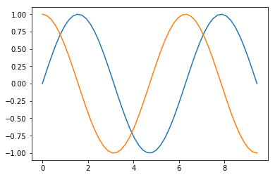

```python
import numpy as np
import matplotlib.pyplot as plt
%matplotlib inline
```

## Hausaufgabe
## 1.
0. Hinter den Links befindet sich jeweils eine Erklärung und Beispiele zu den Funktionen/Methoden. Versuche die Aufgabe erst selbstständig zu lösen. Schaue erst dann bei den Beispielen nach, wenn du nicht weiterkommst. 
1. Erzeuge den folgenden Graphen, indem du eine Variable $x$ mit der [numpy.linspace](https://docs.scipy.org/doc/numpy/reference/generated/numpy.linspace.html) Funktion erstellst. 
2. Erzeuge anschließend zwei Variablen $y, y_1$ mit der Funktion [numpy.sin](https://docs.scipy.org/doc/numpy-1.10.4/reference/generated/numpy.sin.html) und [numpy.cos](https://docs.scipy.org/doc/numpy/reference/generated/numpy.cos.html). 
3. Wenn du die [plt.plot](https://matplotlib.org/examples/pylab_examples/simple_plot.html) Funktion mehrmals hintereinander ausführst, dann wird das Ergebnis im gleichen Graphen dargestellt.


```python
x = np.linspace(0, 3*np.pi)
y = np.sin(x)
plt.plot(x,y, label='sin')
y2 = np.cos(x)
plt.plot(x,y2, label='cos')
plt.xlabel('X')
plt.ylabel('Y')
plt.legend()
#plt.plot(x+2,y)
```


    [<matplotlib.lines.Line2D at 0x7f47275ab6a0>]





## 2.
Erzeuge den folgenden Graphen, indem du zu den  Variablen $y, y2$ Zufallswerte addierst. Dazu kannst du die folgende Funktion verwenden: $numpy.random.rand$. Die Erklärung zu dieser Funktion findest du online.


```python
y = y+np.random.rand(50)*0.1
y2 = y2+np.random.rand(50)*0.1
plt.plot(x,y, '-o', label='sin gemessen')
plt.plot(x,y2, '-o', label='cos gemessen')
plt.xlabel('X')
plt.ylabel('Y')
plt.legend()
```


    [<matplotlib.lines.Line2D at 0x7f47274a75c0>]


